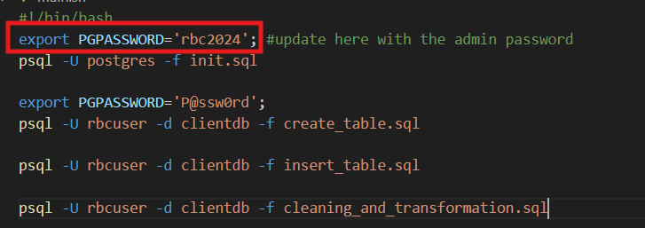
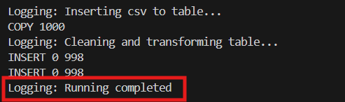

# Project

## Overview
This project consists of the following components:

1. **`main.sh`**: A shell script that runs a list of SQL files sequentially.
2. **`MOCK_DATA.csv`**: A CSV file containing mock data used for testing or populating a database.
3. **`utils.py`**: A Python script containing utility functions that can be used for interacting with the database or processing data.
4. **`requirements.txt`**: The list of Python dependencies (e.g., `pandas`) needed to run the provided Python functions.
5. **`playbook.ipynb`**: A guide with examples on how to use the Python functions from `utils.py`.

## Assumptions and Prerequisites
User has basic idea with installing and creating environment, ability to run scripts

- You have the following software installed:
  - **Python** (3.x version)
  - **PostgreSQL** it is localhost and 5432 port is opened for connection
  - **Shell (bash)** for executing `main.sh`
  - **Jupyter notebook** for executing `playbook.ipynb`

- You have access to a **PostgreSQL database** where the SQL files can be executed.
- You already have the admin account and password

## Project folder structure

```
.
├── images
│   ├── completed.png
│   ├── insert.png
│   └── main.png
├── sql_script
│   ├── cleaning_and_transformation.sql
│   ├── create_table.sql
│   ├── init.sql
│   └── insert_table.sql
├── MOCK_DATA.csv
├── README.md
├── main.sh
├── playbook.ipynb
├── requirement.txt
└── utils.py
```

### Running the Code
To run the project, follow these steps:
1. Clone the repository or download the files. 
2. Update the main.sh with your admin password <br>

3. Update the insert_table.sql with your absolute path for the mock_data.csv <br>

4. In the project folder, running the Shell Script (`main.sh`)
   ```bash
   bash main.sh
5. Confirm the running completed  by looking for the system message <br>

6. Open playbook.ipynb and try consuming the utils function by running the notebook

## Schema
Schema consists of three layers: `landing`, `raw`, and `transformed`. Each layer serves a different purpose in the database, ranging from raw data ingestion to cleaned and transformed data ready for user consumption.

## Schema Overview

| **Layer**          | **Description**                                                                                          |
|--------------------|----------------------------------------------------------------------------------------------------------|
| **Landing**   | Raw data directly received from source systems. No transformations or validations are applied here.       |
| **Raw** | Data from Landing after basic validations such as data type checks and format validations by table definition. |
| **Transformed**  | Cleaned and transformed data that is ready for use by business users. Final version of the data. |

## Data Flow

- **Landing**: Data is ingested into the landing schema, where it is stored in its raw form, making it available for further cleaning or transformation.
- **Raw**: In this layer, the raw data undergoes basic validation, such as checks for missing or invalid values, data type consistency, and required field validation. This layer serves as a reference for troubleshooting and debugging, and it prepares the data for downstream processing.
- **Transformed**: The transformed layer represents the production-ready data. Here, the data is cleansed, enriched, and structured into a business-friendly format, making it ready for use by business analysts, reporting tools, and other downstream applications.

## Data Cleaning
- Removed unnecessary or unwanted columns to streamline the dataset.
- Filtered out records with invalid data types or columns that may have shifted, ensuring data integrity.

## Playbook

This playbook provides a Jupyter Notebook (`.ipynb`) for users to leverage Python utility functions, including `connect_database`, `read_data_from_client_table`, and `alter_data_for_client_table`. Below are the details of each function:

1. **connect_database**:  
   Establishes a connection to the database by creating a connection object.

2. **read_data_from_client_table**:  
   Uses the connection object to retrieve data from a client table based on user-provided parameters, allowing for flexible data querying.

3. **alter_data_for_client_table**:  
   Uses the connection object to update or modify data in a client table according to user-defined parameters, enabling data transformation and cleaning.

## Difficulties

1. The source data contains issues, including invalid formats and additional columns.
2. Due to the presence of invalid data, some records may be lost during the cleaning and transformation process.
3. Communication with the source system/provider is necessary to ensure alignment of the table definitions between the source and target systems.

## Limitations & Potential Improvements

1. Depending on the requirements, limiting access to or masking passwords may be necessary for security purposes.
2. Database user credentials should be stored separately in a secure location, such as a key vault, to enhance security.
3. If the source system does not align with the table definitions, consider changing the landing schema from a static table to a dynamic table.
4. Improved data cleaning logic could be implemented if more detailed information is provided.
5. Adding tests for the Python functions.
6. Implementing checks to determine whether a creation sql script needs to be executed.
